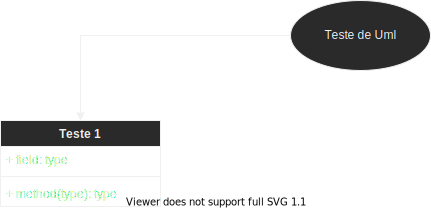

[]
[]

# Projeto Order Manager

Projeto de gerenciador de pedidos com Ruby on Rails e Postgres.

### No projeto é utilizado:

- GithubActions para Continuous Integration (CI)
- Postgres 13 como banco de dados 

### Estrutura do Projeto

### Status do Projeto

- [x] Idealização  
      - [x] Requisitos e Casos de Uso
- [x] Desenvolvimento
      - [x] Testes unitários
      - [] Cobertura de testes
- [ ] Aplicação em produção

Aviso: Testo várias coisas nesse repositório. E sim, você encontrará inconformidades aqui.  
Aviso²: Se algo aqui te ajudar, tá valendo. Busque retribuir.   
